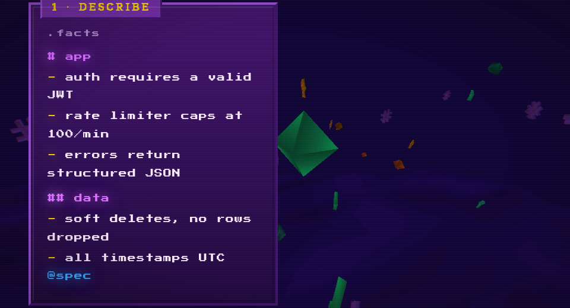
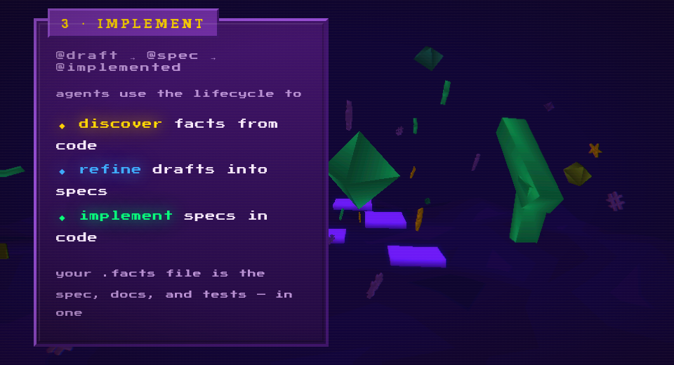

<div align="center">


Testable specs for AI coding agents.

[](LICENSE)
[](https://github.com/av/facts/releases)

</div>

A `.facts` file is a flat list of claims about your project. Each claim can have a shell command that proves it. `facts check` runs them all.

```yaml
# auth
- label: JWT tokens expire after 1 hour
  command: grep -q 'expires.*3600' src/auth.rs
- label: refresh tokens are rotated on use
  command: grep -q 'rotate_refresh' src/auth.rs
- passwords are bcrypt-hashed, cost factor 12

# api
- label: rate limiter caps at 100 req/min
  command: grep -q 'rate_limit.*100' src/middleware.rs
- all endpoints return structured JSON errors
```

```
$ facts check

passed
  ✓ k2z  auth > JWT tokens expire after 1 hour
  ✓ r1b  auth > refresh tokens are rotated on use

failed
  ✗ a8d  api > rate limiter caps at 100 req/min

manual
  ? e4a  auth > passwords are bcrypt-hashed, cost factor 12
  ? p3f  api > all endpoints return structured JSON errors

2 passed, 1 failed, 2 manual
```

Exit 0 when everything passes. Non-zero when anything fails. That's the whole idea.

## Install

```sh
curl -fsSL https://raw.githubusercontent.com/av/facts/main/install.sh | sh
```

```sh
npm install -g @avcodes/facts        # or npm
pip install facts-cli                 # or pip
```

Rust. Single binary. Two dependencies (`clap`, `anyhow`). Linux, macOS, Windows.

## Quick start

```sh
cd your-project
facts init
facts check
```

`init` detects your stack (Cargo, package.json, pyproject.toml, etc.), creates a `.facts` file with initial project truths, and installs agent skills. `check` tells you what's true right now.

---

## The problem

You wrote a spec. Your agent read it. Fifty commits later, half of it describes code that no longer exists. The doc says "REST API" but someone switched to GraphQL in week two. Nobody noticed because nobody checks.

Long specs are the wrong abstraction for agentic development. They're too verbose for agents to parse reliably, too unstructured to validate, and they drift from code silently. You end up with a 2,000-word PRD that your agent skims, misinterprets, and builds against a version of the project that no longer exists.

facts treats your spec like a type system treats your code. Each fact is a single, atomic claim. If it has a command, the command is the test. `facts check` is the compiler. Either your project matches the spec or it doesn't.

## How it works

<table>
<tr>
<td width="33%"></td>
<td width="33%"></td>
<td width="33%"></td>
</tr>
</table>

**Describe.** Write facts in a `.facts` file. Plain strings for claims humans verify. YAML mappings with a `command` key for claims the machine can check. Organize into sections with `#` headings.

**Verify.** `facts check` lints all files first, then runs every command-fact. Commands execute via `$SHELL` in the project root. Exit 0 = the fact holds. Non-zero = it doesn't. Results are grouped: green pass, red fail, yellow manual.

**Implement.** Three lifecycle tags drive the agent workflow: `@draft` (rough idea) &rarr; `@spec` (precise, actionable) &rarr; `@implemented` (true, code-backed). Built-in skills handle each transition. The `.facts` file becomes spec, docs, and regression suite in one place.

---

## The format

A `.facts` file is valid Markdown *and* valid YAML per section.

```yaml
# section
- a plain string fact (verified manually)
- label: a fact with a check command
  command: test -f src/main.rs
  tags: [core, mvp]
```

| Key | Required | Purpose |
|-----|----------|---------|
| `label` | yes | The claim |
| `command` | no | Shell command — exit 0 = true |
| `tags` | no | Freeform tokens for filtering |
| `id` | no | Override the auto-generated ID |

**Sections** use Markdown headings. Nesting creates hierarchy addressable by path (`api/auth`). Sections are created when you add to them, removed when empty.

**Tags** filter with boolean expressions: `--tags "core and not blocked"`. Three well-known tags (`@draft`, `@spec`, `@implemented`) drive the lifecycle, but any tag works.

**IDs** are 3+ character hashes of the label, stable as long as the label doesn't change.

---

## Agent integration

`facts init` installs skills that any compatible coding agent can use — Claude Code, Cursor, Windsurf, or anything that supports skill files.

| Skill | Transition |
|-------|------------|
| **facts** | Core CLI operations — read, check, add, edit, remove |
| **facts-discover** | Scan codebase &rarr; classify every fact by lifecycle stage |
| **facts-refine** | `@draft` &rarr; `@spec` — sharpen rough ideas into precise specs |
| **facts-implement** | `@spec` &rarr; `@implemented` — build specs into code |

The agent reads the fact sheet to understand the project, implements against it, and runs `facts check` to verify its own work. The feedback loop is automatic: spec &rarr; code &rarr; verify &rarr; repeat.

Add this to your `CLAUDE.md` or agent config:

```
Always run `facts check` after making changes.
Fix any failing facts before moving on.
Use lifecycle tags to track progress: @draft → @spec → @implemented.
```

---

## Commands

```
facts                                    # list all facts (default)
facts check                              # run all checks, report pass/fail/manual
facts check --tags "mvp and not blocked" # filter by tag expression
facts add "claim" --section api          # add a fact
facts edit <id> --add-tag spec           # modify a fact
facts remove <id>                        # remove a fact
facts get <id>                           # look up a single fact
facts move <id> --section new/path       # relocate a fact
facts list --section api/auth            # filter by section
facts lint                               # validate file structure
facts fmt                                # normalize all files
facts init                               # scaffold project + install skills
facts uninit                             # remove facts from project
```

---

## Dogfooding

This repo uses a `.facts` file to describe itself. 224 facts. 154 verified by command. 0 failing.

```
$ facts check
...
154 passed, 0 failed, 70 manual
```

The fact sheet *is* the spec. Clone the repo and run `facts check` to see it work.

---

## License

MIT
